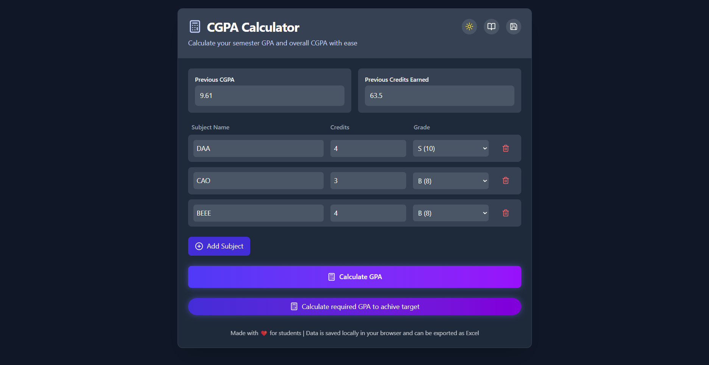
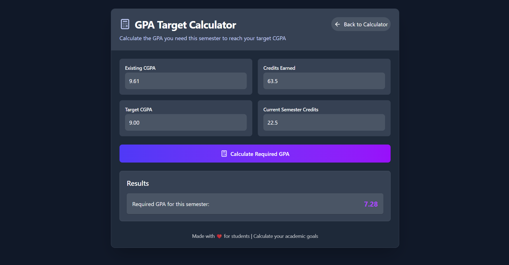

<div align="center">

# 📊 CGPA Checker for VITians

**Effortlessly track your academic performance — clean, fast & beautiful.**


</div>

---

## 💪Made By💪

🧑‍💻 [Dhruv Gadre](https://github.com/Dhruv-Gadre)

👑 [Anuraag Shankar](https://github.com/anuraaggg)

---

## 🚀 Features

- 🎓 Calculate **CGPA** and **SGPA** with ease
- 💡 Smart input fields for subject names and credits
- 📱 Fully **responsive UI** — works across all devices
- 🌈 Sleek, modern interface with **Tailwind CSS**
- ⚡ Built with **ReactJS** for fast, reactive performance

---

## 📸 Preview




> Try it out 👉 [Click Here](https://cgpa-checker-ruby.vercel.app/)

---

## 🛠️ Tech Stack

| Tech            | Description                   |
| --------------- | ----------------------------- |
| ⚛️ React JS     | Frontend Framework + Logic    |
| 💨 Tailwind CSS | Styling and Responsive Design |
| 🌐 Vercel       | Deployment platform           |

---

## 🧮 How CGPA Calculation Works

```text
Grade Points:
S = 10, A = 9, B = 8, C = 7, D = 6, E = 5, F = 0

Formula:
CGPA = Σ(Credit × Grade Point) / Σ(Credit)
```

## 🌟 Contributing

Contributions are welcome! Here's how you can help:

- 💡 Suggest a feature
- 🐛 Report a bug
- 🎨 Improve UI/UX
- 📦 Add more grade systems (other colleges?)

```bash
# Create a new branch
git checkout -b your-feature-name

# Commit your changes
git commit -m "Add: Your cool feature"

# Push to GitHub
git push origin your-feature-name
```

---

## 🙌 Made For VITians

This project was built with ❤️ for students at **VIT Chennai** and beyond.  
Whether you're double-checking your GPA or just curious, this tool is here to help!
