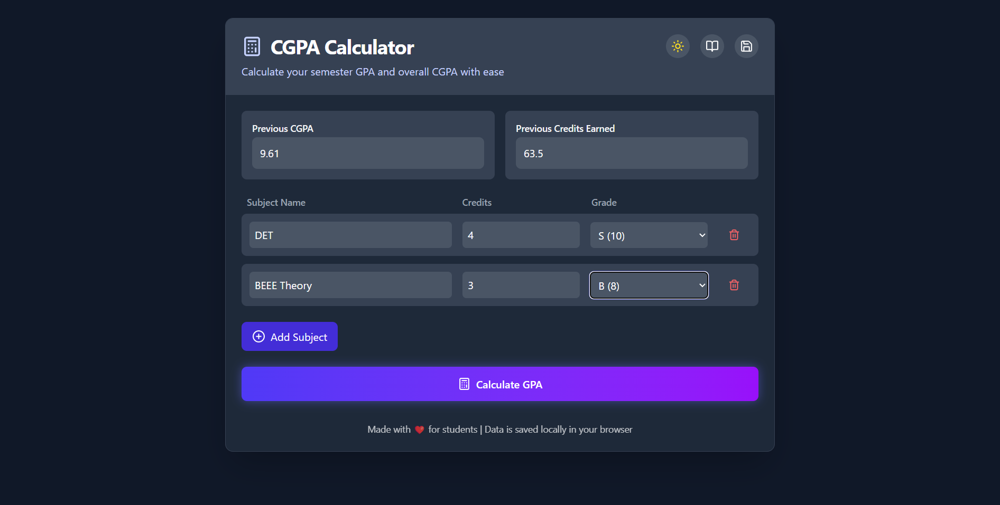

<div align="center">

# 📊 CGPA Checker for VITians

**Effortlessly track your academic performance — clean, fast & beautiful.**


</div>

---

## 🚀 Features

- 🎓 Calculate **CGPA** and **SGPA** with ease
- 💡 Smart input fields for subject names and credits
- 📱 Fully **responsive UI** — works across all devices
- 🌈 Sleek, modern interface with **Tailwind CSS**
- ⚡ Built with **ReactJS** for fast, reactive performance

---

## 📸 Preview



> Try it out 👉 [Live Demo](https://your-deployed-site.vercel.app)

---

## 🛠️ Tech Stack

| Tech                | Description                         |
| ------------------- | ----------------------------------- |
| ⚛️ React JS         | Frontend Framework                  |
| 💨 Tailwind CSS     | Styling and Responsive Design       |
| 🔢 JavaScript       | Dynamic logic and data manipulation |
| 🌐 Vercel / Netlify | Deployment platform (Optional)      |

---

## 🧮 How CGPA Calculation Works

```text
Grade Points:
S = 10, A = 9, B = 8, C = 7, D = 6, E = 5, F = 0

Formula:
CGPA = Σ(Credit × Grade Point) / Σ(Credit)
```
